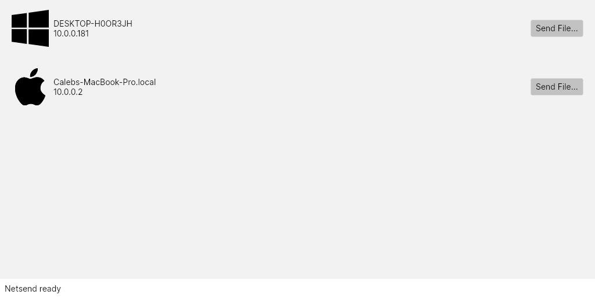

# Netsend

Netsend is a cross-platform clone of Apple's AirDrop, written in .NET

## Purpose

This is meant as an exercise for me to learn .NET in the context of a more complex project.
It's all still early on in development, so don't expect anything super functional at this point.

## Architecture

#### Netsend.BackgroundServices

This assembly runs in the background and has three main tasks: broadcasting the client to the local network; finding other clients on the local network; and keeping a running list of discovered clients on the network, adding newly discovered clients and removing clients that are no longer present.
It is structured as a loop that runs in the background each second.

#### Netsend.Networking

This is the library that handles the actual logic of the server broadcast and discovery over UDP, as well as establishing the direct connection with the peer over TCP.
NetworkDiscovery contains methods for broadcasting the current system's hostname and operating system over UDP; and for finding other clients' UDP broadcasts, returning a FoundClient object that's used by BackgroundServices.Worker.
TcpTools contains the logic-flow for the two-way communication that happens over TCP when a file-transfer is requested.
This library also contains a definition for a type ObservableString, which can basically be thought of as a string that raises a PropertyChanged event whenever it's changed.
I might like to move this and some of my other custom classes to a Netsend.Types library in the future.

#### Netsend.Models

This library defines data structures used by other libraries.
It is written in F# for its cleaner syntax, type safety, and immutability.
I may rewrite this in C# and rename it Netsend.Types, as I have many more custom types scattered throughout the other projects here that wouldn't make sense to implement in F#, and I'd like to consolidate them all in one place.

#### Netsend.UI.Common

This contains the UI code and is also the main entrypoint executable.
This is an AvaloniaUI project that uses the MVVM architecture.
Upon launch, the UI executable starts up BackgroundServices.Worker as an async task, and then starts the TcpListener using Networking.TcpTools.
Then the window is drawn and the ViewModel subscribes to events in order to update the UI based on changes to the list of clients maintained by BackgroundServices.Worker and the TcpStatus ObservableString in Networking.TcpTools.
Ultimately there may be additional UI libraries (Netsend.UI.Windows, Netsend.UI.Linux, Netsend.UI.Mac) which will implement platform-specific bits such as a system tray icon and maybe file explorer integration, but this is all stuff to be added at the end.

## Progress

Currently, the app runs, advertises itself on the local network over UDP, and will discover other instances of the app running on the local network.
Other running app clients on the network are displayed in the GUI with their hostnames and an OS-specific icon.
The send file button opens a file selector, then establishes a TCP connection with the selected client and sends messages back and forth containing filename and size information.
This is accomplished by serializing structs into byte arrays, rather than using a format like JSON.

## Building

Netsend depends on .NET 8 and AvaloniaUI, but besides those dependencies, all it should take is a clone of the repository and a `dotnet run` in the Netsend.UI.Common project to get it all going.
I've built and run the app with success on both Linux and Windows.
~~It builds but fails to run on MacOS at the moment, something about the part of Netsend.BackgroundServices that gets a list of the local machine IP addresses.~~
~~I'm not sure if this is some permissions issue with the OS blocking access, or if that specific function is just unavailable on MacOS, but either way, I'll have that issue buttoned up one way or another prior to release.~~
It seems to be running on MacOS now (don't ask me how or why) with weird graphical glitches.
I'll sort it out eventually.
I don't think .NET supports BSD yet, but _if_ it does, and _if_ this builds there, the BSD-heads out there will have to live with the fact that they'll show up as a Linux icon to other clients :laughing:

## What's next?

Next step is implementing the actual file transfers.
After that, I'll be extending the file transfer to allow for full directories.
